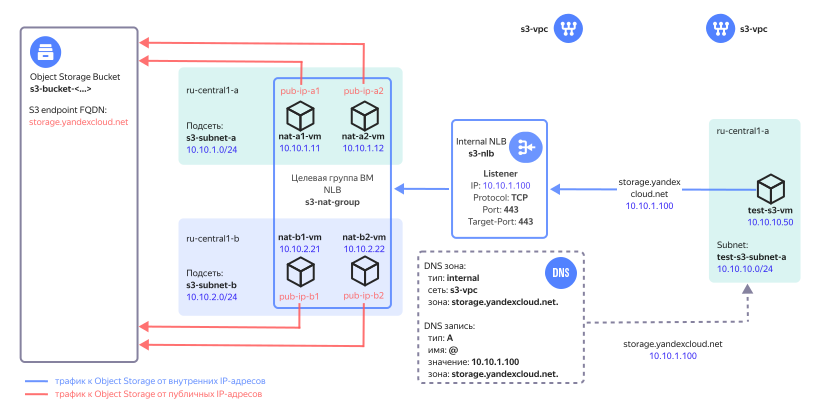

# Connecting to Object Storage from a VPC

## Contents

- [About the solution](#описание-решения)
- [Tips for solution deployment in the production environment](#рекомендации-по-развертыванию-решения-в-продуктивной-среде)
- [Preparing for deployment](#подготовка-к-развертыванию)
- [Deploying Terraform configuration](#развертывание-terraform-сценария)
- [Health check](#проверка-работоспособности)
- [Deleting the created resources](#удаление-созданных-ресурсов)

## About the solution

In Yandex Cloud, you can connect to [Yandex Object Storage](https://yandex.cloud/docs/storage/) via the appropriate [API Endpoint](https://yandex.cloud/docs/api-design-guide/concepts/endpoints/) whose FQDN is then translated to a public IP address using DNS.

In this example, you will deploy a cloud infrastructure in Yandex Cloud to set up access to Object Storage for resources that are hosted in the [VPC](https://yandex.cloud/docs/vpc/concepts/) cloud network and have no public IP addresses or access to the Internet through a [NAT gateway](https://yandex.cloud/docs/vpc/concepts/gateways).



While deploying this solution, you will be creating the following components in Yandex Cloud:

| Name | Description |
| ---- | ---- |
| `s3-vpc` `*` | Cloud network with resources being connected to Object Storage. |
| `s3-nlb` | Internal network load balancer accepting traffic to Object Storage. The load balancer accepts TCP traffic with destination port 443 and distributes it across resources (VMs) in a target group. |
| `s3-nat-group` | Load balancer target group with VMs that have NAT enabled. |
| `nat-a1-vm`, `nat-a2-vm`, `nat-b1-vm`, `nat-b2-vm` | NAT instances in the `{{ region-id }}-a` and `{{ region-id }}-b` [availability zones](../../overview/concepts/geo-scope.md) for routing traffic to Object Storage and back with translation of IP addresses of traffic sources and targets. | 
| `pub-ip-a1`, `pub-ip-a2`, `pub-ip-b1`, `pub-ip-b2` | VM public IP addresses to which the VPC cloud network translates their internal IP addresses. | 
| `DNS zone and A record` | The internal `storage.yandexcloud.net.` DNS zone in the `s3-vpc` network with a type `A` resource record that maps the `storage.yandexcloud.net` domain name to the IP address of the internal network load balancer. |
| `s3-bucket-<...>` | Bucket in Object Storage |
| `s3-subnet-a`, `s3-subnet-b` | Cloud subnets to host NAT instances in the `ru-central1-a` and `ru-central1-b` zones. |
| `test-s3-vm` | Test VM to verify access to Object Storage. |
| `test-s3-subnet-a` | Cloud subnet to host the test VM. |

`*` *When deploying, you can also specify an existing cloud network.*

For a cloud network with the resources hosted in [Cloud DNS](https://yandex.cloud/docs/dns/concepts/), create an internal DNS zone named `storage.yandexcloud.net.` and a type `A` resource record that maps the `storage.yandexcloud.net` domain name of Object Storage to the IP address of the [internal network load balancer](https://yandex.cloud/docs/network-load-balancer/concepts/nlb-types). With this record, traffic from cloud resources to Object Storage will be routed to the internal load balancer that will distribute the load across the NAT instances. 

NAT instance deployment uses an [image from Marketplace](https://yandex.cloud/marketplace/products/yc/nat-instance-ubuntu-22-04-lts) enabling IP address translations for both source and target to route traffic to the Object Storage public IP address.

By placing the NAT instances in multiple [availability zones](https://yandex.cloud/docs/overview/concepts/geo-scope), you can ensure fault-tolerant access to Object Storage. By increasing the number of NAT instances, you can scale the solution up if the workload increases. When calculating the number of NAT instances, consider the [locality of traffic handling by the internal load balancer](https://yandex.cloud/docs/network-load-balancer/concepts/specifics#nlb-int-locality). 

[Object Storage access policies](https://yandex.cloud/docs/storage/concepts/policy) only allow actions with buckets from public IP addresses of NAT instances. Bucket access is only granted to the cloud resources using this solution. You cannot connect to a bucket in Object Storage via a public API endpoint. You can disable this limitation by specifying the relevant parameter in Terraform, if required.

## Tips for solution deployment in the production environment

- When deploying NAT instances in multiple availability zones, set an even number of VMs to evenly distribute them across the availability zones.
- When selecting the number of NAT instances, consider the [locality of traffic handling by the internal load balancer](https://yandex.cloud/docs/network-load-balancer/concepts/specifics#nlb-int-locality).
- Once the solution is deployed, reduce the number of NAT instances or update the list of availability zones in the `yc_availability_zones` parameter only during a pre-scheduled time window. When the changes are being applied, traffic handling may be interrupted.
- If a NAT instance demonstrates a high `CPU steal time` metric value as the Object Storage workload goes up, you may want to enable a [software-accelerated network](https://yandex.cloud/docs/vpc/concepts/software-accelerated-network) for that NAT instance.
- By default, access to Object Storage buckets is allowed via the Yandex Cloud management console. You can disable it using the `bucket_console_access = false` parameter. 
- If you skip `mgmt_ip` with `bucket_private_access = true`, the solution deployment using Terraform on a workstation will fail with a bucket access error.
- When using a custom DNS server, make sure to create type `A` records in its configuration. These records must be in the following format:

    | Name | Type | Value |
    | ----------- | ----------- | ----------- |
    | `storage.yandexcloud.net.` | `A` | `<internal_load_balancer_IP_address>` |
    | `<bucket_name>.storage.yandexcloud.net.` | `A` | `<internal_load_balancer_IP_address>` |
	
- Save the `pt_key.pem` private SSH key used to connect to the NAT instances to a secure location or recreate it separately from Terraform.
- Once the solution is deployed, SSH access to the NAT instances will be disabled. To enable it, add a rule for incoming SSH traffic (TCP/22) in the `s3-nat-sg` security group, which will allow access only from certain IP addresses of admin workstations.
- After the health check, delete the test VM and its subnet.

## Preparing for deployment

1. Before you start deployment, [sign up for Yandex Cloud and create a billing account](https://yandex.cloud/docs/tutorials/infrastructure-management/terraform-quickstart#before-you-begin).

2. [Install Terraform](https://yandex.cloud/docs/tutorials/infrastructure-management/terraform-quickstart#install-terraform).

3. Check if there is an account in the cloud with `admin` permissions for the folder.

4. [Install and configure the Yandex Cloud CLI](https://yandex.cloud/docs/cli/quickstart).

5. [Install Git](https://github.com/git-guides/install-git).

6. Check whether your cloud quotas allow you to deploy your resources for this scenario:

    <details>
    <summary>Expand to see the amount of resources created for this scenario</summary>

    | Resource | Amount |
    | ----------- | ----------- |
    | Virtual machines | 5 |
    | VM vCPUs | 10 |
    | VM RAM | 10 GB |
    | Disks | 5 |
    | HDD size | 30 GB |
    | SSD size | 40 GB |
    | Network load balancer | 1 |
    | Target group for the load balancer | 1 |
    | Networks | 1`*` |
    | Subnets | 3 |
    | Static public IP addresses | 4 |
    | Security groups | 1 |
    | DNS zone | 1 |
    | Bucket | 1 |  
    | Service accounts | 2 |
    | Static key for the service account | 1 |

    `*` *If the user did not specify the existing network ID in `terraform.tfvars`*.

    </details>

7. Make sure you have a cloud resource folder in Yandex Cloud before proceeding to deployment.

## Deploying Terraform configuration

1. Clone the `yandex-cloud-examples/yc-s3-private-endpoint` GitHub [repository](https://github.com/yandex-cloud-examples/yc-s3-private-endpoint/) to your local machine and go to the `yc-s3-private-endpoint` directory:
    ```bash
    git clone https://github.com/yandex-cloud-examples/yc-s3-private-endpoint.git
    
    cd yc-s3-private-endpoint
    ```

2. Set up the deployment environment (see the details [here](https://yandex.cloud/docs/tutorials/infrastructure-management/terraform-quickstart#get-credentials)):

    ```bash
    export YC_TOKEN=$(yc iam create-token)
    ```

3. Enter your custom values in the `terraform.tfvars` file. Refer to the table below to see which parameters need changing.

    <details>
    <summary>View detailed info on the values to enter</summary>

    | Parameter<br>name | Change<br>required | Description | Type | Example |
    | --- | --- | --- | --- | --- |
    | `folder_id` | Yes | ID of the folder to host the solution components. | `string` | `b1gentmqf1ve9uc54nfh` |
    | `vpc_id` | - | ID of the cloud network to connect to Object Storage. If skipped, a VPC will be created. | `string` | `enp48c1ndilt42veuw4x` |
    | `yc_availability_zones` | - | List of the <a href="https://yandex.cloud/docs/overview/concepts/geo-scope"> availability zones</a> for deploying NAT instances  | `list(string)` | `["ru-central1-a", "ru-central1-b"]` |
    | `subnet_prefix_list` | - | List of prefixes of cloud subnets to host the NAT instances (one subnet in each availability zone from the `yc_availability_zones` list in the following order: `ru-central1-a`, `ru-central1-b`, etc). | `list(string)` | `["10.10.1.0/24", "10.10.2.0/24"]` |
    | `nat_instances_count` | - | Number of NAT instances to deploy. We recommend setting an even number to evenly distribute the instances across the availability zones. | `number` | `4` |
    | `bucket_private_access` | - | Only allow bucket access from the public IPs of NAT instances. If `true`, access is limited. To remove the limit, set `false`. | `bool` | `true` |
    | `bucket_console_access` | - | Allow bucket access via the Yandex Cloud management console. If `true`, access is allowed. To deny access, set `false`. This parameter is required if `bucket_private_access` is set to `true`. | `bool` | `true` |
    | `mgmt_ip` | Yes | Public IP of your workstation where you are deploying Terraform configuration. It is used to enable your workstation to perform actions with the bucket when deploying Terraform. This parameter is required if `bucket_private_access` is set to `true`. | `string` | `A.A.A.A` |
    | `trusted_cloud_nets` | Yes | List of aggregated prefixes of cloud subnets authorized to access Object Storage. It is used in the rule for incoming traffic of security groups for the NAT instances.  | `list(string)` | `["10.0.0.0/8", "192.168.0.0/16"]` |
    | `vm_username` | - | NAT instance and test VM user names. | `string` | `admin` |
    | `s3_ip` | - | Object Storage public IP address. | `string` | `213.180.193.243` |
    | `s3_fqdn` | - | Object Storage domain name. | `string` | `storage.yandexcloud.net` |  
    
    </details>

4. Initialize Terraform:

    ```bash
    terraform init
    ```

5. Check the list of cloud resources you are about to create:

    ```bash
    terraform plan
    ```

6. Create resources:

    ```bash
    terraform apply
    ```

7. Once `terraform apply` is complete, the command line will output the info required for connecting to the test VM and running test operations with Object Storage. Later on, you can view this info by running the `terraform output` command:

    <details>
    <summary>View info on deployed resources</summary>

    | Name | Description | Sample value |
    | ----------- | ----------- | ----------- |
    | `path_for_private_ssh_key` | File with a private key used to connect to the NAT instances and test VM over SSH. | `./pt_key.pem` |
    | `vm_username` | NAT instance and test VM user names. | `admin` |
    | `test_vm_password` | `admin` user password for the test VM. | `v3RСqUrQN?x)` |
    | `s3_bucket_name` | Bucket name in Object Storage. | `s3-bucket-5efzzpvmys` |
    | `s3_nlb_ip_address` | IP address of the internal load balancer. | `10.10.1.100` |
    
    </details>


## Health check

1. In the Yandex Cloud console, navigate to the `folder_id` folder, select `Compute Cloud` and then `test-s3-vm` from the list of VMs. Connect to the VM serial console, enter the `admin` username and the password from the `terraform output test_vm_password` command output (without quotation marks).

2. In the VM serial console, run the `dig storage.yandexcloud.net` command and verify that the Object Storage domain name in the DNS server response matches the IP address of the internal load balancer. The output of the type `A` resource record is as follows:

    ```
    ;; ANSWER SECTION:
    storage.yandexcloud.net. 300    IN      A       10.10.1.100
    ```

3. Get an object from the bucket in Object Storage using the [AWS CLI](https://yandex.cloud/docs/storage/tools/aws-cli) command. The bucket name will be fetched from the test VM environment variable. 

    ```
    aws --endpoint-url=https://storage.yandexcloud.net \
    s3 cp s3://$BUCKET/s3_test_file.txt s3_test_file.txt
    ```

    Result:
	
    ```
    download: s3://<bucket_name>/s3_test_file.txt to ./s3_test_file.txt
    ```

4. You can additionally run a number of commands to test operations with Object Storage. The bucket name will be fetched from the test VM environment variable.
   
   Upload the downloaded test file to the bucket under a different name:
   
    ```
    aws --endpoint-url=https://storage.yandexcloud.net \
    s3 cp s3_test_file.txt s3://$BUCKET/textfile.txt
    ```
    
    Result:
	
    ```
    upload: ./s3_test_file.txt to s3://<bucket_name>/textfile.txt
    ```

    Get a list of objects in the bucket:
	
    ```
    aws --endpoint-url=https://storage.yandexcloud.net \
    s3 ls --recursive s3://$BUCKET
    ```

    Result:
	
    ```
    2023-08-16 18:24:05         53 s3_test_file.txt \
    2023-08-16 18:41:39         53 textfile.txt
    ```

    Delete the object you uploaded to the bucket:
	
    ```
    aws --endpoint-url=https://storage.yandexcloud.net \
    s3 rm s3://$BUCKET/textfile.txt
    ```

    Result:
	
    ```
    delete: s3://<bucket_name>/textfile.txt
    ```


## Deleting the resources you created

To delete resources created using Terraform, run `terraform destroy`.

> **Important**
> 
> Terraform will permanently delete all the resources that were created while deploying the solution.
